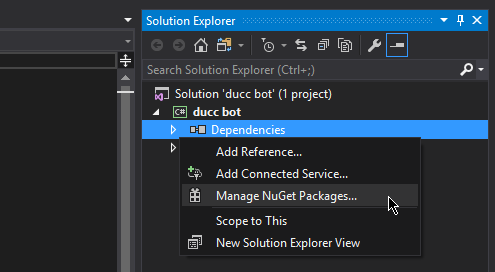
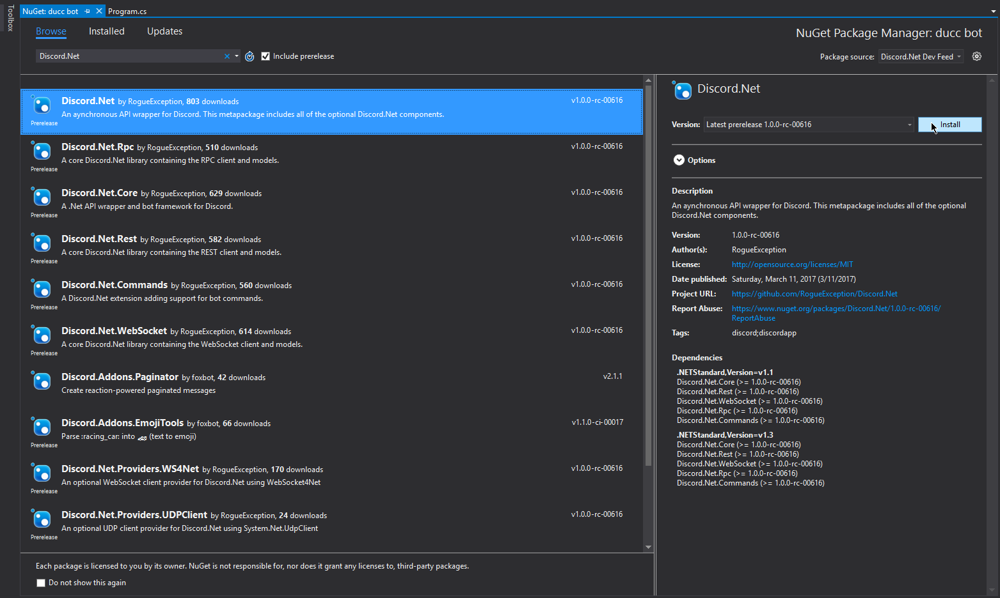

Discord.Net is distributed through the NuGet package manager, and it is
recommended to use NuGet to get started.

Optionally, you may compile from source and install yourself.

# Supported Platforms

Currently, Discord.Net targets [.NET Standard] 1.3, and offers support for
.NET Standard 1.1. If your application will be targeting .NET Standard 1.1,
please see the [additional steps](#installing-on-.net-standard-11).

Since Discord.Net is built on the .NET Standard, it is also recommended to
create applications using [.NET Core], though you are not required to. When
using .NET Framework, it is suggested to target `.NET 4.6.1` or higher.

[.NET Standard]: https://docs.microsoft.com/en-us/dotnet/articles/standard/library
[.NET Core]: https://docs.microsoft.com/en-us/dotnet/articles/core/

# Installing with NuGet

Release builds of Discord.Net 1.0 will be published to the
[official NuGet feed].

Development builds of Discord.Net 1.0, as well as [addons](TODO) are published
to our development [MyGet feed].

Direct feed link: `https://www.myget.org/F/discord-net/api/v3/index.json`

Not sure how to add a direct feed? See how [with Visual Studio]
or [without Visual Studio](#configuring-nuget-without-visual-studio)

[official NuGet feed]: https://nuget.org
[MyGet feed]: https://www.myget.org/feed/Packages/discord-net
[with Visual Studio]: https://docs.microsoft.com/en-us/nuget/tools/package-manager-ui#package-sources

## Using Visual Studio

1. Create a solution for your bot
2. In Solution Explorer, find the 'Dependencies' element under your bot's
project
3. Right click on 'Dependencies', and select 'Manage NuGet packages'

4. In the 'browse' tab, search for 'Discord.Net'

> [!TIP]
Don't forget to change your package source if you're installing from the
developer feed.
Also make sure to check 'Enable Prereleases' if installing a dev build!
5. Install the 'Discord.Net' package

## Using JetBrains Rider
**todo**

## Using Visual Studio Code
**todo**

# Compiling from Source

In order to compile Discord.Net, you require the following:

### Using Visual Studio

- [Visual Studio 2017](https://www.visualstudio.com/)
- [.NET Core SDK 1.0](https://www.microsoft.com/net/download/core#/sdk)

The .NET Core and Docker (Preview) workload is required during Visual Studio
installation.

### Using Command Line

- [.NET Core SDK 1.0](https://www.microsoft.com/net/download/core#/sdk)

# Additional Information

## Installing on .NET Standard 1.1

For applications targeting a runtime corresponding with .NET Standard 1.1 or 1.2, 
the builtin WebSocket and UDP provider will not work. For applications which
utilize a WebSocket connection to Discord (WebSocket or RPC), third-party
provider packages will need to be installed and configured.

First, install the following packages through NuGet, or compile yourself, if
you prefer:

- Discord.Net.Providers.WS4Net
- Discord.Net.Providers.UDPClient

Note that `Discord.Net.Providers.UDPClient` is _only_ required if your bot will
be utilizing voice chat.

Next, you will need to configure your [DiscordSocketClient] to use these custom
providers over the default ones.

To do this, set the `WebSocketProvider` and optionally `UdpSocketProvider`
properties on the [DiscordSocketConfig] that you are passing into your
client.

[!code-csharp[NET Standard 1.1 Example](samples/netstd11.cs)]

[DiscordSocketClient]: xref:Discord.WebSocket.DiscordSocketClient
[DiscordSocketConfig]: xref:Discord.WebSocket.DiscordSocketConfig

## Configuring NuGet without Visual Studio

If you plan on deploying your bot or developing outside of Visual Studio, you
will need to create a local NuGet configuration file for your project.

To do this, create a file named `nuget.config` alongside the root of your
application, where the project solution is located.

Paste the following snippets into this configuration file, adding any additional
feeds as necessary.

[!code-xml[NuGet Configuration](samples/nuget.config)]